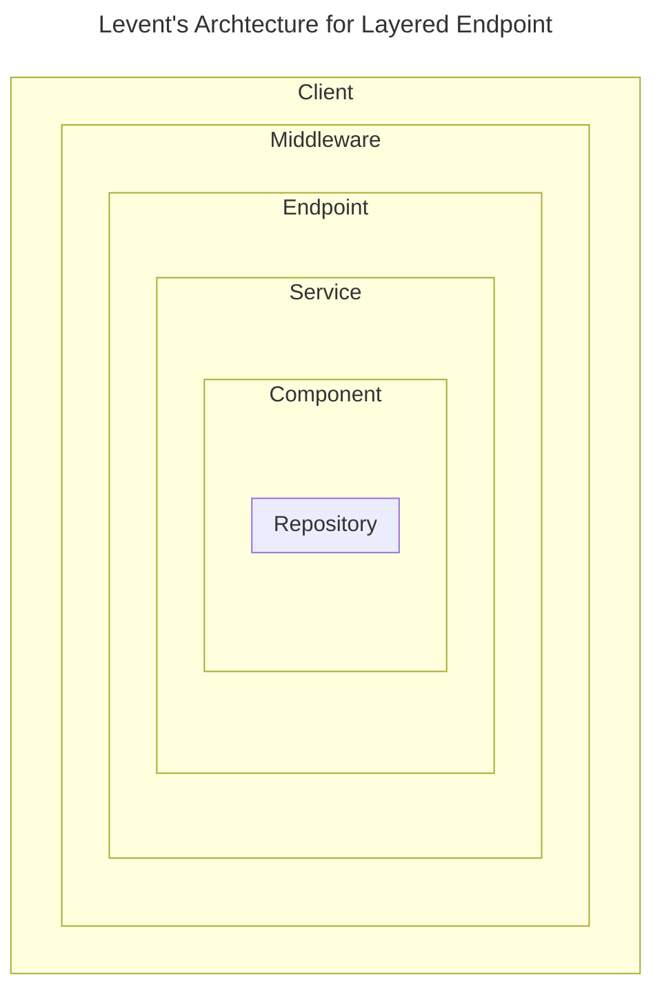

# Project Guidelines

My collection of my notes, templates and guidelines for working on php based software projects.

- [Project Guidelines](#project-guidelines)
  - [LALE](#lale)
  - [Feature implementation check list](#feature-implementation-check-list)
  - [Must haves](#must-haves)
  - [Composer.json](#composerjson)

## LALE



- Client * - mainly used when the project is with a microservice architecture or the API is going to be used by a third party
- Middleware - Hooks attached before passing the request to the controller and post processsing the response.
- Endpoint - Configured route path and http method and class handling the request
- Service - The class executing the business logic. It may used in other places besides the endpoint(injected into another service or from the command line or event handler)
- Component * - The simplier version of Service. Using it may prevent nested service injection. Usually wraps the repository.
- Repository - Access to the data. It may use a database, endpoint or files.

## Feature implementation check list
- [ ] Manual testing
- [ ] Tests & coverage
- [ ] Logging
- [ ] Error handling

## Must haves

- [ ] Virtualization(using Docker)
- [ ] Editorconfig
- [ ] PHPunit
- [ ] PHP CodeSniffer
- [ ] PHPStan
- [ ] CI

## Composer.json

```json
"require-dev": {
  "phpunit/phpunit": "^10.0",
  "phpstan/phpstan": "^1.10",
  "roave/security-advisories": "dev-master",
  "squizlabs/php_codesniffer": "^3.7"
}
```